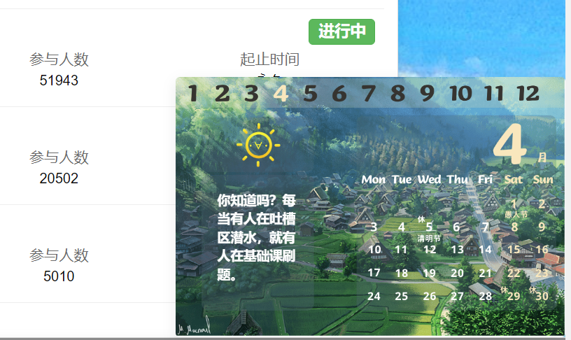
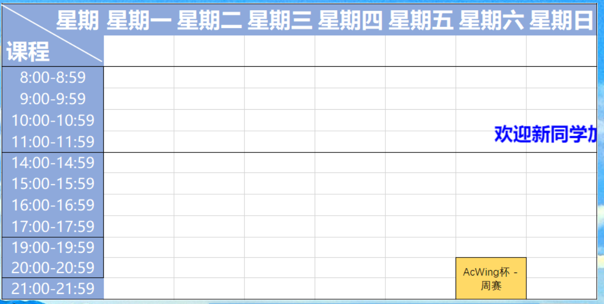
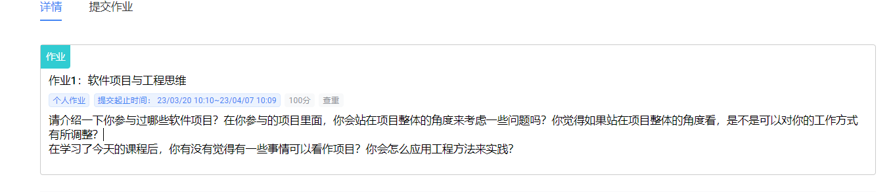
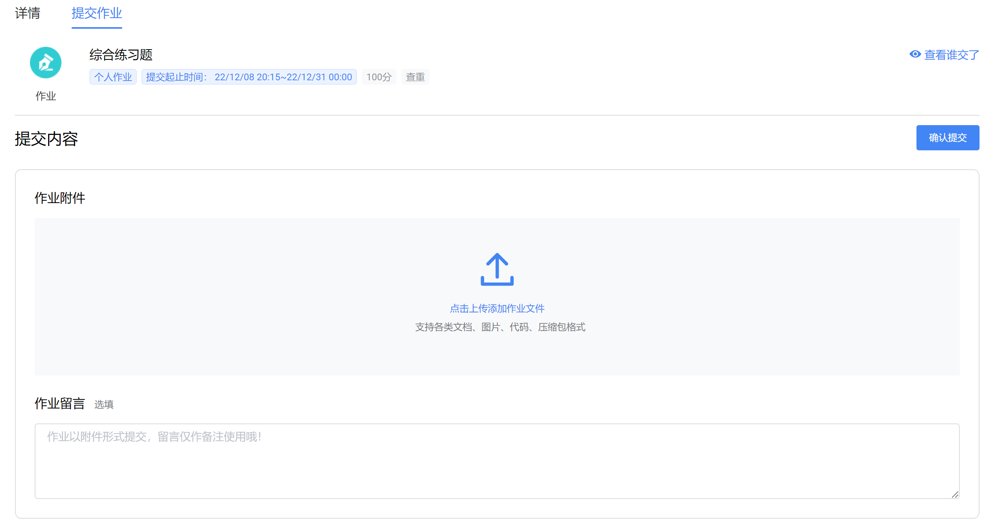
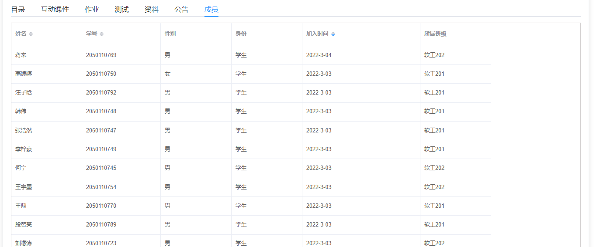
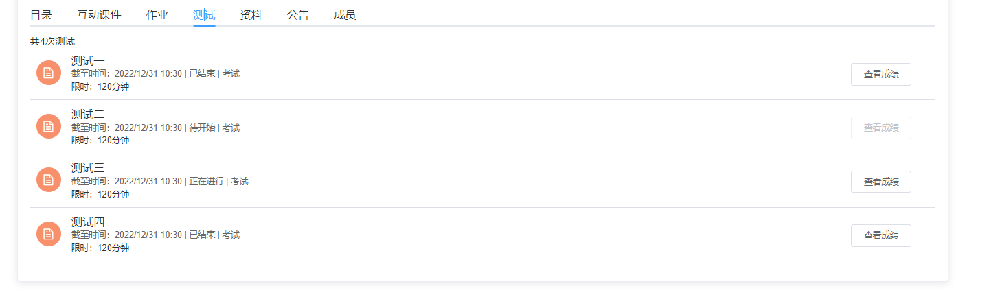
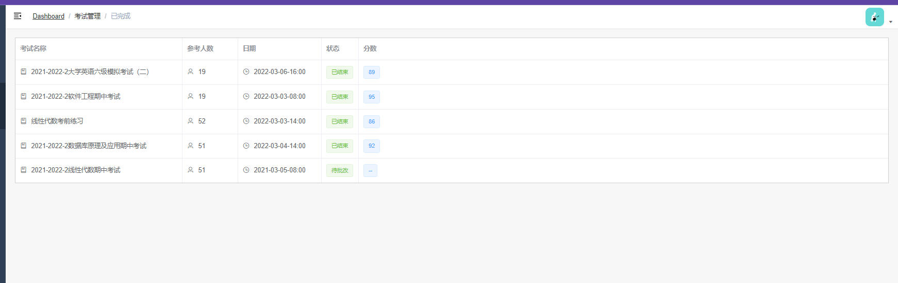
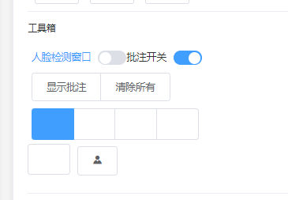

# 待办事项

❌：尚未完成  
✅：已经完成  
完成一项把❌改成✅

## 首页

- [x] 日历可以考虑花哨一点，参考ACwing的日历
	
- [x] 添加课程表，可以抄acwing的 ，然后稍作改进 
	
- [✅] final version数据修改 

## 我的课程

- ✅ 作业这一块，要显示作业的一些要求，在最上方有详情和提交作业两个子栏，咱们做一块就行了  
  	  
  	 
- ✅ 把表格线去掉，然后给人的名字前面加一个圆形头像，头像图片先随便弄几个就行  
  	  
- ✅ 不用查看成绩了，直接把成绩写这就行了
  	
- ✅ final version数据修改

## 考试管理
- ✅ 尽可能横向填充一下，不然右侧空着的页面太多了，至于下方空页面，多加几条数据填一下就好了。顺便把面包屑上的dashboard改一下  
	
- ✅ 不要两个子页面我的考试和已完成考试了，直接合并起来

### 我的考试

- ✅在进入考试时，取消设备检测    
- ✅ 考试工具箱的icon消失   
	  
- ✅ 本次考试以数据结构为例，将答题卡有顺序的并且做好标注的调整为以下题型
	`选择`，`判断`，`简答`，`算法设计`  
	其中，算法设计直接拿本次实验部分的数据结构实验过来
- ✅ 大规模的final version数据修改从英语考试适配到本次任务上来  

### 已完成考试

- ✅ final version数据修改 

## 我的实验

- ✅ 样式方面的改进，换一些图片  
- ✅ final version数据修改

## 网盘

- ✅ final version数据修改

## 个人中心

- ✅ final version数据修改

## 其他方面

- ✅ 整个系统里，响应圆圈的时间设置的有点太长了，会给人感觉明显的卡顿，没有必要这么做，设置短一点，进入一个页面的时候，平滑地切过去就可以了
